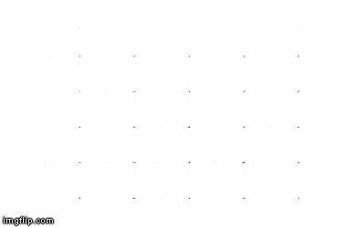

# GAN-Keras
Generative Adversarial Network Implementations in Keras

gan.ipynb - GAN implementation using Keras for mnist and fashion-mnist dataset.

cgan.ipynb - Conditional GAN implementation using Keras for mnist/Fashion mnist dataset.

acgan.ipynb - Auxiliary Classifier keras implementation for mnist dataset.

